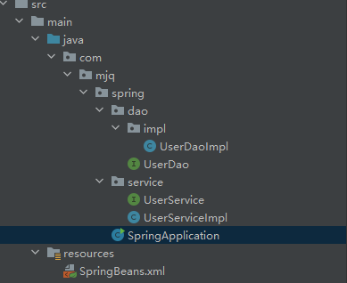
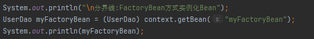
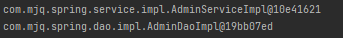
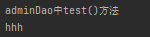

# Spring中Xml文件配置以及使用注解消除Xml


## Spring搭建及配置Bean

先创建一个常规Maven项目，然后在pom文件中添加以下内容:

```
<!--Spring核心-->
<dependency>
    <groupId>org.springframework</groupId>
    <artifactId>spring-context</artifactId>
    <version>5.3.7</version>
</dependency>
```

之后在项目resources目录下创建XML文件(名称自取),将下面内容拷贝到xml文件中

```
<beans xmlns="http://www.springframework.org/schema/beans"
       xmlns:xsi="http://www.w3.org/2001/XMLSchema-instance"
       xsi:schemaLocation="http://www.springframework.org/schema/beans
    https://www.springframework.org/schema/beans/spring-beans.xsd">
    
</beans>
```

然后就可以通过xml文件的方式进行Bean的配置

1. 创建一个Service及其实现类
2. 创建类，获取xml的配置，获取bean对象

大致结构如下:


进行Bean的配置,在xml文件中添加以下内容


在main函数中读取xml文件并获取对应的Bean


运行结果如下:


> 这里的两个工厂区别如下:
>
> 

## Bean的详细配置


1. 配置id属性，则该BeanName为id属性的值，若不配置，默认使用全限定名(class属性的值)
2. 配置name属性，可指定多个别名(中间用 ',' 分割)，仍可用id属性获取Bena
3. 配置scope属性，即Bean的作用范围，如单例、多例等
4. 配置lay-init（懒加载）,使用到该bean时才会创建
5. 配置init、destory-method,可以在创建实例后以及Spring容器关闭前，执行特定方法

##Bean的实例化配置

### 依赖注入


> 集合数据类型注入时，使用<property>标签，在其内部使用对应的<list>、<map>标签

#### 注入方式


在项目中创建UserDao及其实现类，在UserServiceImpl类中添加set方法，在xml文件中使用
<property ref="xml中bean名称" name="依赖别名，用于调用set方法">

项目结构如下图:



UserServiceImpl类:


Xml文件:


main函数


运行结果如下:


#### 拓展:自动装配方式


### 构造方法方式

####无参

上文中UserServiceBean和UserDaoBean均为无参构造

#### 有参

需要在Xml文件中，配置Bean   <constructor-arg name="参数名" value="参数值">

如下:(可配置多个参数)


### 工厂方式

####静态工厂

创建一个类，包含返回对应Bean的静态方法


Xml文件中配置静态工厂


运行结果如下:  
(注意:此处使用的是ApplicationContext,因此配置文件加载后就创建bean, 即 "静态工厂创建对象")


#### 实例工厂

创建一个类，包含返回对应Bean的非静态方法


Xml文件配置


main函数


运行结果


> 上面的两个工厂创建对象均没有指定参数，有参数的设置与构造方法一致，使用<constructor-arg>标签设置参数
>

#### 实现FactoryBean<T>

接口源码


  创建类实现FactoryBean


Xml文件


main函数



运行结果


## 注解方式替换XML配置

根据上面Xml的配置，我们已经知道:程序需要加载对应的xml文件，然后根据xml文件中的标签解析Bean。那如果我们要消除xml的使用,需要做到以下2点:

1. 采用一种方式替代xml文件，也就是使用配置类   (@Configuration)
2. 使用注解替代原xml文件中的标签

### 配置类 @Configuration注解的使用

创建类SpringConfig并添加注解，用作配置类


> 此处的@ComponentScan注解用于替代标签:
> `<context:component-scan base-package="com.mjq.spring"></context:component-scan>`

由于我们未使用XMl文件配置Bean,故要使用新的方式加载配置类

```
AnnotationConfigApplicationContext(配置类.class/"beanName");
```

这样，我们就实现了配置类替代xml文件

### @Component注解的使用


为了更直观的演示注解替代XML配置的不同,创建AdminService、AdminDao及其实现类，但使用注解进行配置。

AdminDao:


main函数:


运行结果:


### 依赖注入

向Bean AdminService中注入AdminDao

AdminDao:


AdminServiceImpl:


main函数:


运行结果:



> @Autowired根据类型进行注入，如果同一类型的Bean有多个，会根据名称进行注入，若仍不匹配，将会报错
>
> @Autowired也可添加到函数上，根据参数类型注入对应的Bean,与函数名无关
>
> 
>
> @Qualifier("Bean名")  可指定名称、注入相应Bean
>
> @Resource 注解也可用于注入

#### 注入参数

为了方便演示，在AdminDao及其实现类中添加下面内容

AdminDao:


AdminDaoImpl:


main函数:


运行结果:


运用这个方法，可以通过读取配置文件,(如yml或properties),配置对应Bean

#####使用@Value

在resources目录下创建配置文件 application.properties   ,并添加以下内容:


配置类中添加@PropertySource注解,将我们创建的文件添加进去


然后在@Value中使用


main函数:


运行结果如下:


## 结束语

至此，已经实现了Spring中Xml文件配置以及使用注解消除Xml的整个过程，但有很多地方并未涉及。比如配置数据库、第三方框架等。而且并未涉及其底层原理，想要知其所以然、此篇文章肯定是不够的。


